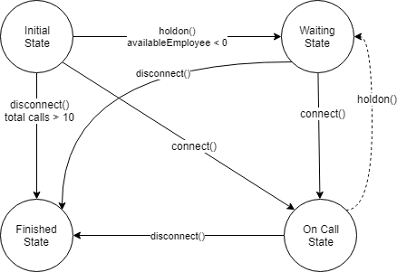

# AlMundo - Ejercicio Java - CallCenter
Ejercicio de evaluación AlMundo.

## Consigna
Existe un call center donde hay 3 tipos de empleados: operador, supervisor y director. El proceso de la atención de una llamada telefónica en primera instancia debe ser atendida por un operador, si no hay ninguno libre debe ser atendida por un supervisor, y de no haber tampoco supervisores libres debe ser atendida por un director.

## Requerimientos
* Debe existir una clase Dispatcher encargada de manejar las llamadas, y debe contener el método dispatchCall para que las asigne a los empleados disponibles.
* El método dispatchCall puede invocarse por varios hilos al mismo tiempo.
* La clase Dispatcher debe tener la capacidad de poder procesar 10 llamadas al mismo tiempo (de modo concurrente).
* Cada llamada puede durar un tiempo aleatorio entre 5 y 10 segundos.
* Debe tener un test unitario donde lleguen 10 llamadas.

## Extras/Plus
* Dar alguna solución sobre qué pasa con una llamada cuando no hay ningún empleado libre.
* Dar alguna solución sobre qué pasa con una llamada cuando entran más de 10 llamadas concurrentes.
* Agregar los tests unitarios que se crean convenientes. 
* Agregar documentación de código

------------------------------
# Resolución

Realizado por [Facundo Morán](https://www.linkedin.com/in/facundomoran/)

Para resolver el ejercicios implemente un modelo simple de 4 entidades principales que representan el contexto de un call center.

La clase Dispacher se encargará de gestionar las llamadas, tanto la asignación como el control de la misma.

Las llamadas (Call) tienen un estado en función de la acción que se realice sobre esta.

La clase CallCenter contiene la lista de empleados disponibles, los cuales se subscriben a una lista que es cosumidad por el dispatcher.

Cuando un empleado toma una llamada se desuscribe, al finalizar la llamada vuelve a subscribirse.

## Modelo

### Estados de una llamada

### Dominio

## Extras
1) No hay empleados libre
   La clase dispatcher es la encargada de controlar si existen empleados disponibles. Como se ejecuta en hilos independientes, en caso de no encontrar un empleado disponible de ningún tipo el hilo queda en espera.

   Se cambia el estado de la tarea a Waiting, simulando una acción sobre la llamada que notifique al cliente que se encuentra en esa situacion.

   A medida que algun empleado se subscriba, se notifica al primer hilo que esta en espera y continua su ejecución.

2) Se supera la cantidad de llamadas y es mayor a 10.
   Para este caso, supongo que el dispatcher no tiene capacidad de poner la llamada en espera, por lo tanto finaliza la misma (la rechaza). Esta accion rechaza la llamada.

Este control esta a cargo del dispatcher. La cantidad de llamada contabiliza en simultaneo las que estan en ejecución y las que estan en espera.

## Ejecucion de pruebas
- **ConcurrentTest.testTenConcurrentCalls()** : prueba que la solución soporta 10 llamadas en simultaneo. 
- **ConcurrentTest.testWaitingEmployee()** : prueba que cuando no hay empleados disponibles y una call debe aguardar a que otro empleado se libere.
- **ConcurrentTest.testRejectedCalls()** : prueba que si hay mas de 10 llamadas, las siguientes se cancelan.

Ejecutar `$mvn clean install` para instalar el proyecto.

Ejecutar `$mvn test` para correr las pruebas unitarias.

## Herramientas
- Maven v3.5.4
- JUnit v4.12
